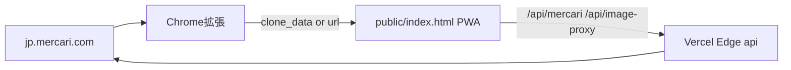

# リポジトリ階層と役割

**フリモーラ**（furimora）は、メルカリの再出品・値下げ・クローン出品を支援するプロジェクトです。Vercel 上の PWA（`public/index.html`）、Edge API、Chrome 拡張、Capacitor 設定、および Stitch 由来のデザイン参照が同じリポジトリにあります。

本番 Web アプリ URL は拡張機能内で `https://furimora-assist.vercel.app` に固定されています（`chrome-extension/background.js`、`chrome-extension/popup.js`）。

## データの流れ（概要）

## ルート直下（設定・デプロイ）

| ファイル | 役割 |
|----------|------|
| `vercel.json` | `/api/*` を API に、それ以外を `public/` にルーティング。API 用 CORS ヘッダ。 |
| `capacitor.config.json` | アプリ ID `jp.furimora.assist`、`webDir: public`、スプラッシュ・ステータスバー・プッシュ通知の設定。 |
| `.gitignore` | 現状 `.vercel` のみ無視。 |
| `.vercel/project.json`, `.vercel/README.txt` | Vercel プロジェクト連携用のローカルメタデータ。 |

ルートに `package.json` はなく、フロントは CDN（Tailwind 等）前提の静的構成です。

## `public/` — メイン Web アプリ（PWA）

| ファイル | 役割 |
|----------|------|
| `index.html` | アプリ本体。Tailwind（CDN）、フォント、Material Symbols、テーマトークンを含む単一 HTML。 |
| `manifest.json` | PWA 名・アイコン・`share_target`・ショートカット定義。 |
| `sw.js` | オフライン用 Service Worker（キャッシュ戦略: HTML は network-first、API は network-only）。 |
| `icons/` | PWA 用アイコン（`manifest.json` / `index.html` の apple-touch-icon と整合）。 |
| `screenshots/` | マニフェストの `screenshots` 用画像（ストア提出・インストール UI 向け）。 |

## `api/` — Vercel Edge Functions

| ファイル | 役割 |
|----------|------|
| `mercari.js` | クエリ `url` から商品 ID を抽出。非公式 JSON API を優先し、失敗時は商品ページの `__NEXT_DATA__` から正規化。 |
| `image-proxy.js` | `mercdn.net` / `mercari-images` の画像のみプロキシし、ブラウザ側の CORS 制約を回避。 |

## `chrome-extension/` — Manifest V3

| ファイル | 役割 |
|----------|------|
| `manifest.json` | `jp.mercari.com/item/*` と `sell/*` にコンテンツスクリプト注入。storage / tabs / alarms / downloads 等。 |
| `content.js` | ページ上にウィジェットを注入。`__NEXT_DATA__` または DOM から商品データ抽出。`EXTRACT_ITEM_DATA` に応答。 |
| `background.js` | タブ作成、値下げ記録と統計（`chrome.storage.local`）、画像一括ダウンロード。 |
| `popup.html` / `popup.js` | 商品ページ検出、Web アプリを `clone_data`（base64 JSON）または `page=clone&url=` で開く。 |
| `content.css` | 注入 UI のスタイル。 |
| `icons/` | 拡張機能マニフェスト用アイコン。 |

## `stitch_extracted/` — デザイン・プロトタイプ参照

パス: `stitch_extracted/stitch_relisting_daily_reduction_control/`

- `marketplace_modern/DESIGN.md`, `aka_assist/DESIGN.md` — デザインシステム文書（英語）。
- `_1`〜`_7`, `ai_1`, `ai_2` の各 `code.html` — 画面単位の HTML 断片（参照用）。

本番の実行経路には直結せず、UI 意図のドキュメント・素材として置かれています。

## パッジョン HTML

| パス | 備考 |
|------|------|
| `pkg/furimora.html` | 配布用などの単体 HTML の可能性。 |
| `furimora-pkg/furimora.html` | 上記と内容が重複している場合は、どちらを正とするか整理するとよい。 |

## `.claude/` — ローカル開発設定

`settings.local.json`, `launch.json` はエディタ／エージェント向け。アプリのビジネスロジックとは無関係です。

## アイコン・スクリーンショットについて

`public/icons/` と `public/screenshots/` にプレースホルダー（ブランド色 `#bb0017` の単色 PNG）を置いています。ストア公開やブランド品質が必要な場合は、正式なデザインアセットに差し替えてください。
